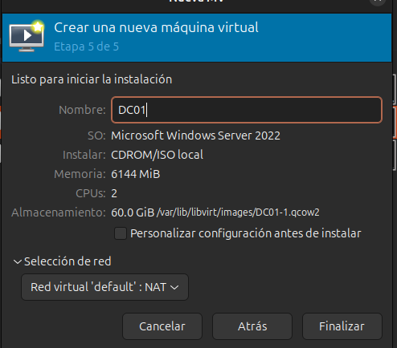
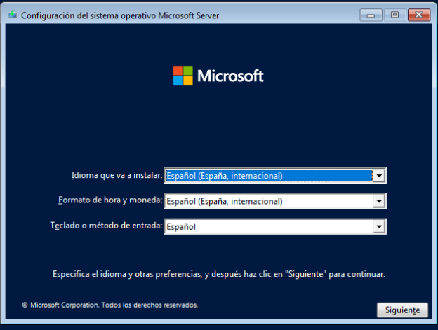
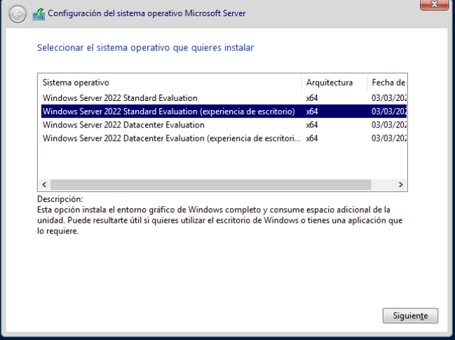
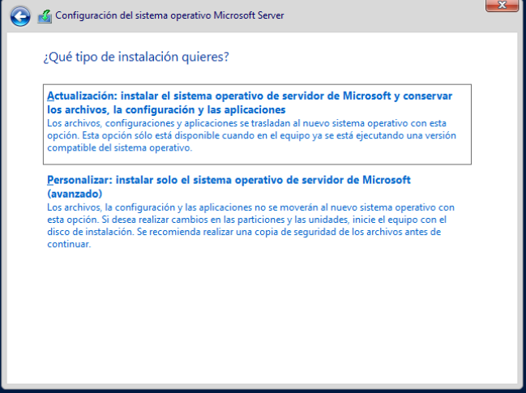
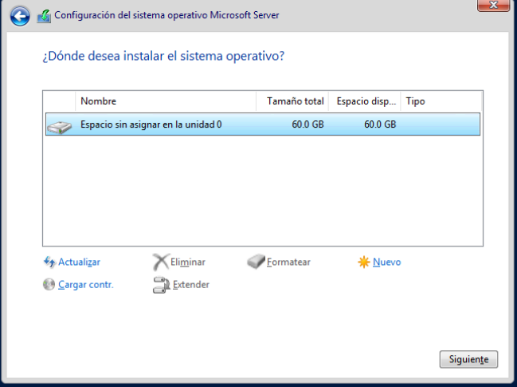
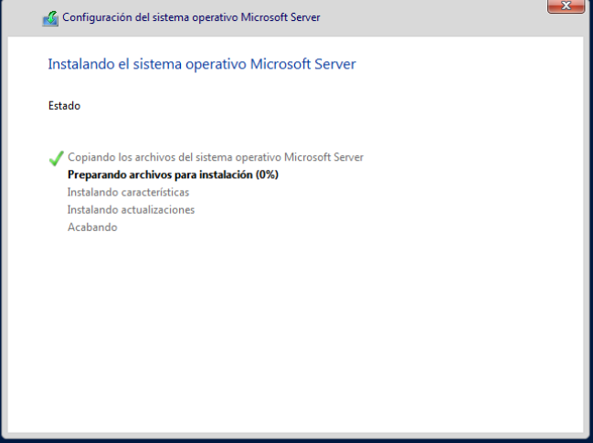
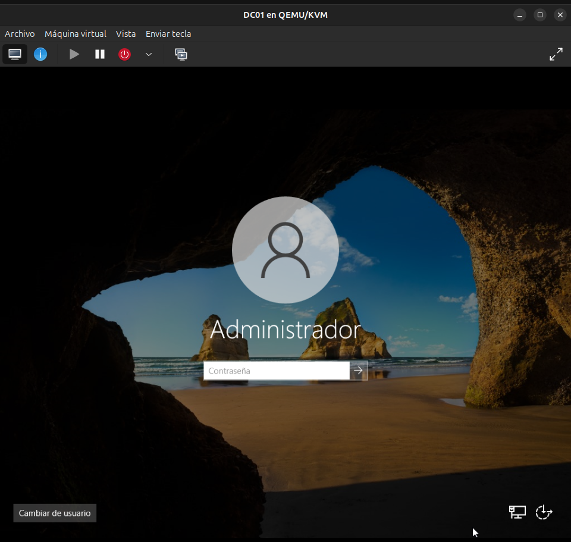
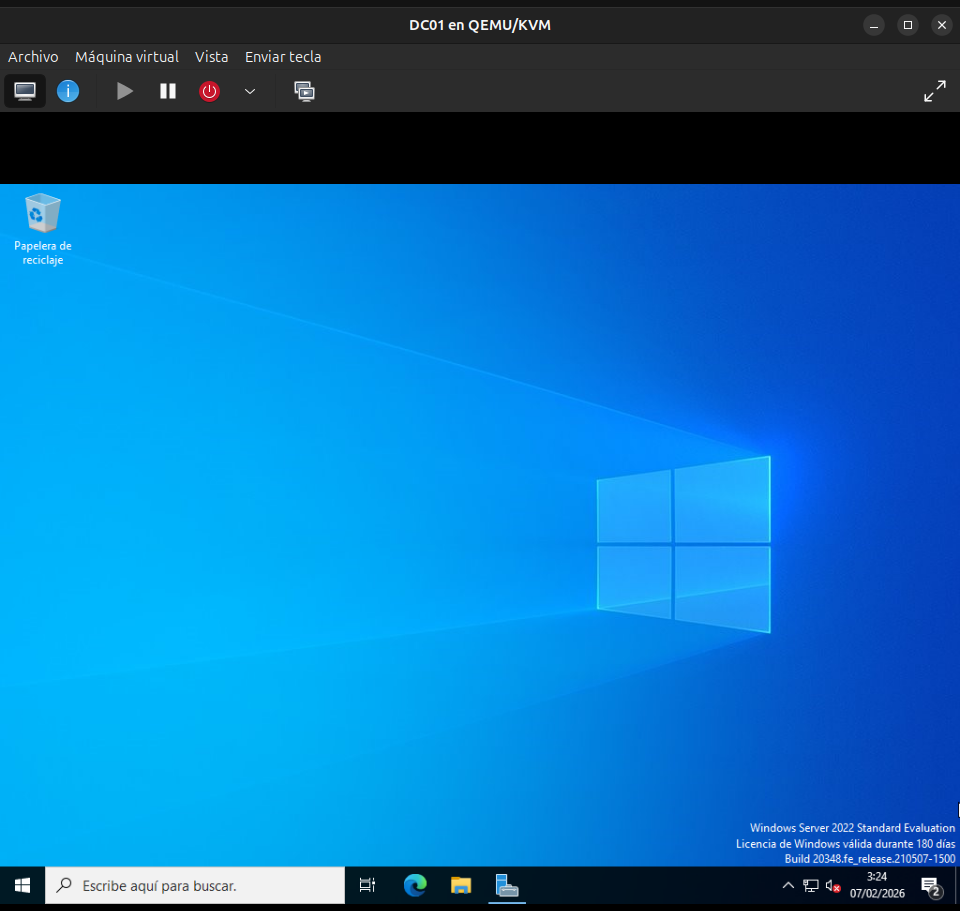

# Instalación de Windows Server 2022 en DC01

## 📌 Descripción
En este documento se describe el proceso de **instalación de Windows Server 2022**
en una máquina virtual utilizando **QEMU/KVM**, como parte del laboratorio de dominio
`darkzone.cl`.

Esta instalación corresponde al servidor **DC01**, que posteriormente será promovido
a Controlador de Dominio con Active Directory y DNS.

---

## 🖥️ Entorno del laboratorio

- Hipervisor: QEMU/KVM
- Gestor: virt-manager
- Servidor: DC01
- Sistema Operativo: Windows Server 2022
- Idioma: Español

---

## 📦 Recursos utilizados

- ISO Windows Server 2022 (Español)
- Entorno virtualizado QEMU/KVM

> Nota: En este laboratorio, el disco fue detectado automáticamente por el instalador
> de Windows, por lo que no fue necesario cargar drivers VirtIO durante la instalación.

---

## 🧱 Creación de la máquina virtual

Se creó una nueva máquina virtual con los siguientes parámetros:

| Recurso | Valor |
|------|------|
| Nombre | DC01 |
| CPU | 2 cores |
| RAM | 6–8 GB |
| Disco | 60 GB |
| Red | NAT |
| Firmware | BIOS |

📸 **Captura:**  

---

## 💿 Inicio del instalador de Windows Server

Al iniciar la máquina virtual, se cargó el instalador de Windows Server.

Configuración inicial:
- Idioma: Español
- Formato de hora: Español
- Teclado: Español

📸 **Captura:**  

---

## 🧩 Selección de edición

Se seleccionó la edición:

- **Windows Server 2022 Standard**
- **Desktop Experience**

Esta opción incluye interfaz gráfica, lo cual facilita el aprendizaje y la administración.

📸 **Captura:**  

---

## ⚙️ Tipo de instalación

Se seleccionó el tipo de instalación:

> **Personalizada (avanzada)**

Esto permite definir manualmente el disco de instalación.

📸 **Captura:**  

---

## 💽 Selección del disco

El instalador detectó correctamente el disco virtual asignado a la máquina,
permitiendo continuar sin necesidad de cargar controladores adicionales.

Se seleccionó el disco disponible y se continuó con la instalación.

📸 **Captura:**  

---

## ⏳ Proceso de instalación

El sistema copió los archivos necesarios y realizó reinicios automáticos
hasta completar la instalación.

📸 **Captura:**  

---

## 🔐 Configuración inicial del sistema

Al finalizar la instalación, se solicitó definir la contraseña del usuario:

- **Administrator**

Una vez establecida la contraseña, se accedió al escritorio de Windows Server.

📸 **Captura:**  

---

## ✅ Instalación completada

Se verificó que:
- El sistema inicia correctamente
- El escritorio de Windows Server carga sin errores
- El servidor está listo para configuración inicial

📸 **Captura:**  

---

## 🧠 Notas importantes

- La instalación se realizó en español para facilitar la documentación
- La configuración de red y nombre del equipo se realiza en una etapa posterior
- Este procedimiento es válido para entornos de laboratorio y aprendizaje

---

## 🚀 Próximo paso

Con el sistema operativo instalado correctamente, el siguiente paso es:

- Cambio de nombre del servidor
- Configuración de IP estática

Nota: En este laboratorio, Windows Server detectó el disco sin necesidad
de cargar drivers VirtIO, utilizando un controlador SATA por defecto.
Esto es válido para entornos de aprendizaje y no afecta la funcionalidad
de Active Directory.
