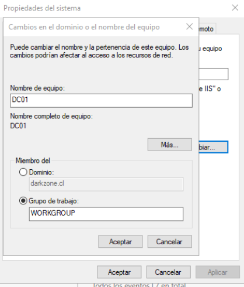
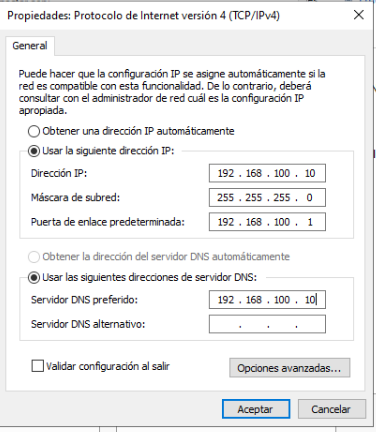

# Configuración inicial del servidor DC01

## 📌 Descripción
Este documento describe la **configuración inicial del servidor Windows Server 2022**
una vez finalizada la instalación del sistema operativo, como preparación para la
implementación del dominio Active Directory.

En esta etapa se realizan las siguientes tareas:
- Cambio de nombre del equipo
- Configuración de red
- Asignación de dirección IP estática

---

## 🖥️ Entorno del laboratorio

- Servidor: **DC01**
- Sistema Operativo: **Windows Server 2022**
- Entorno de virtualización: **QEMU/KVM**
- Rol futuro: **Controlador de Dominio (AD DS + DNS)**

---

## 🔧 Cambio de nombre del servidor

Por defecto, Windows Server asigna un nombre genérico al equipo.  
Antes de instalar Active Directory, es **obligatorio** definir el nombre definitivo
del servidor.

### Pasos realizados

1. Abrir **Administrador del servidor**
2. En **Servidor local**, seleccionar el nombre del equipo
3. Presionar **Cambiar**
4. Asignar el nombre:

5. Aplicar los cambios y reiniciar el sistema

📸 **Captura:**  

---

## 🌐 Configuración de red

Una vez reiniciado el servidor, se accede a la configuración de red para definir
manualmente los parámetros IPv4, ya que un Controlador de Dominio **no debe utilizar DHCP**.

### Ruta de acceso

📸 **Captura:**  

---

## 📡 Asignación de IP estática

Se configuró manualmente la dirección IPv4 con los siguientes valores:

| Parámetro | Valor |
|---------|------|
| Dirección IP | 192.168.100.10 |
| Máscara de subred | 255.255.255.0 |
| Puerta de enlace | 192.168.100.1 |
| DNS preferido | 192.168.100.10 |
| DNS alternativo | — |

El servidor se configura apuntando a sí mismo como DNS, ya que posteriormente
alojará el servicio DNS del dominio.

📸 **Captura:**  

---

## ✅ Verificación de la configuración

Para comprobar que la configuración fue aplicada correctamente, se utilizó
el siguiente comando desde la consola:

cmd
ipconfig
