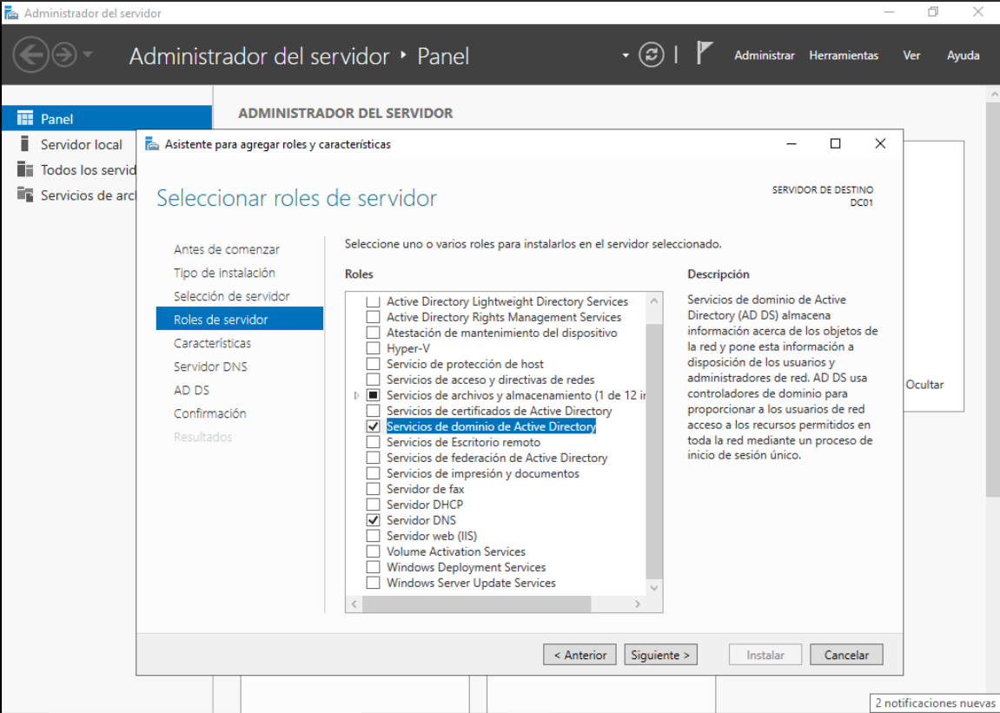
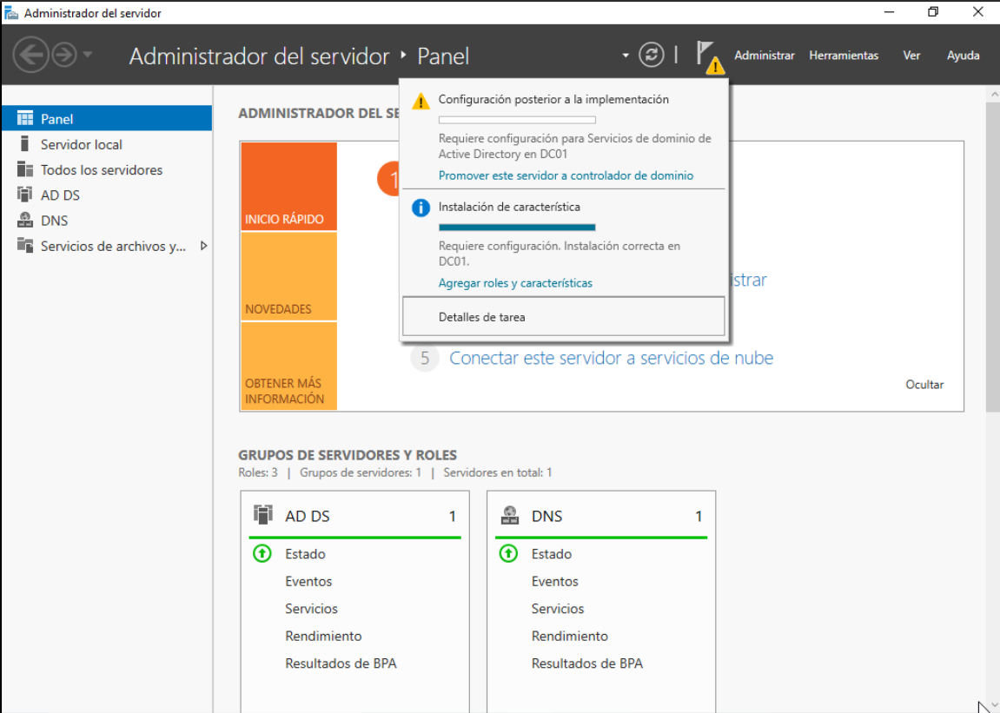
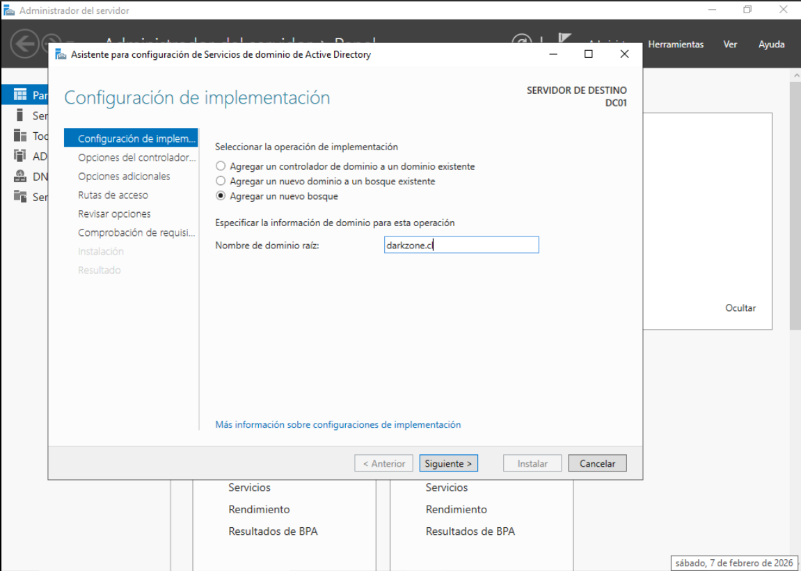
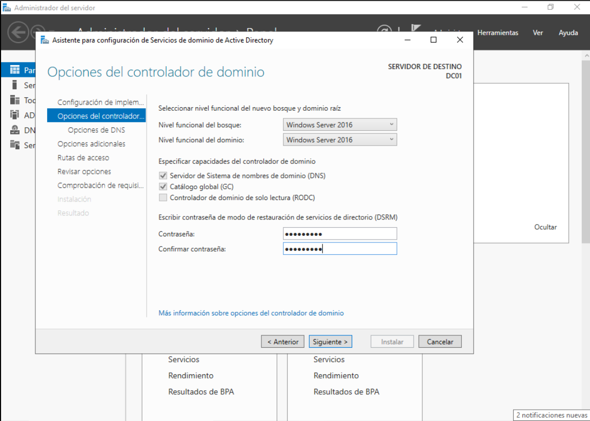
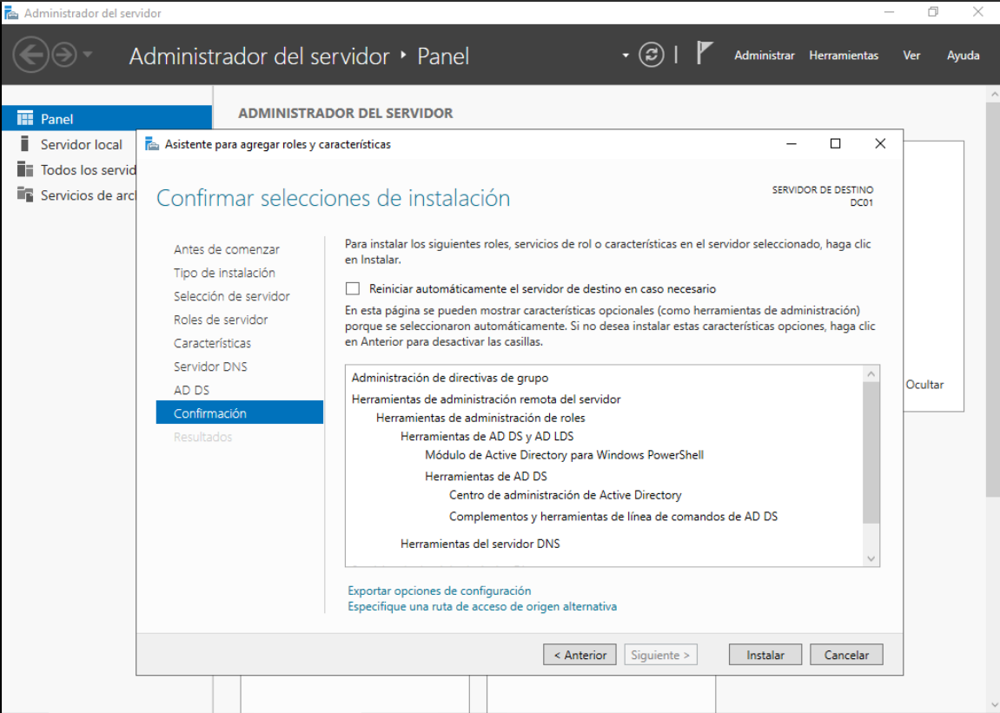
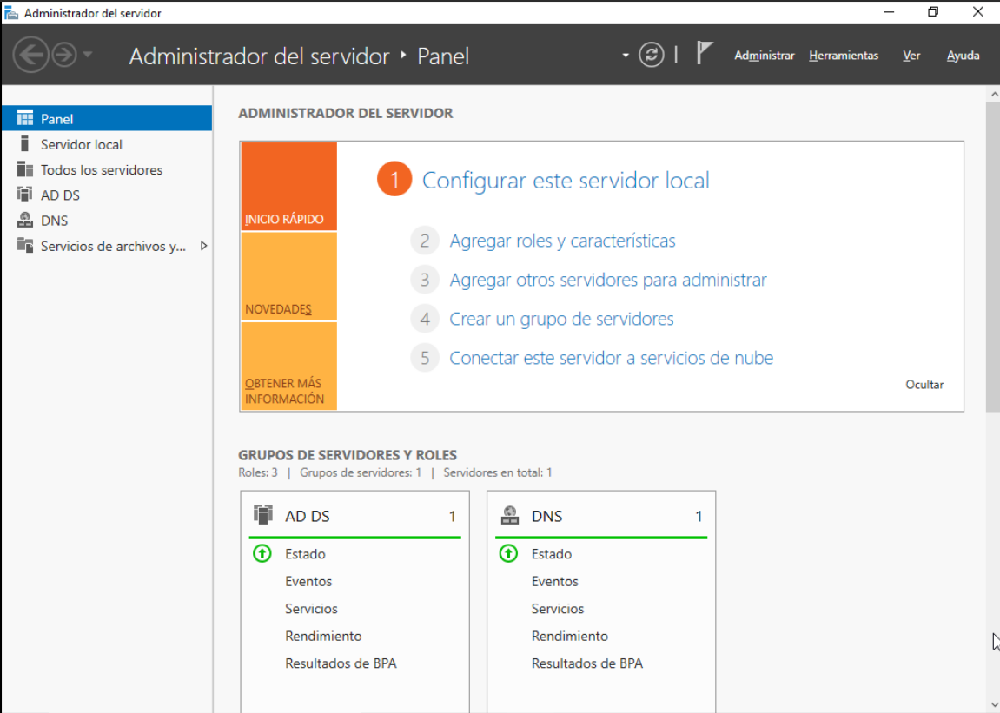
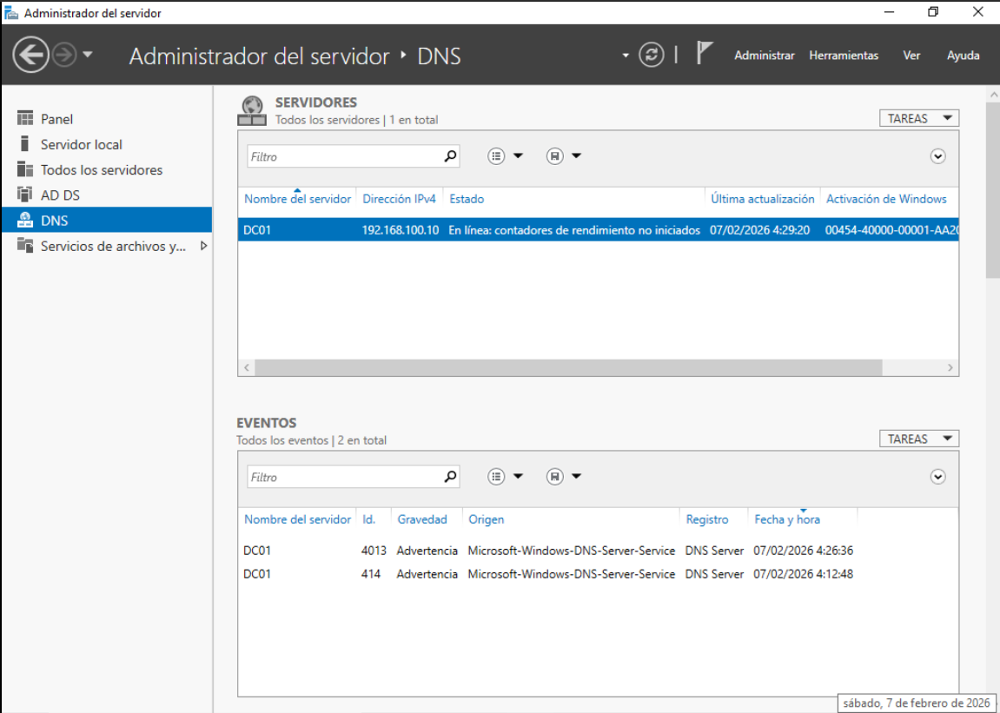

# Creación del dominio Active Directory `darkzone.cl`

## 📌 Descripción
En este documento se describe el proceso de **instalación de los roles de Active Directory**
y la **promoción del servidor DC01 a Controlador de Dominio**, creando un nuevo bosque
con el dominio `darkzone.cl`.

Esta etapa transforma el servidor DC01 en el **núcleo de autenticación y resolución DNS**
del laboratorio.

---

## 🖥️ Entorno del laboratorio

- Servidor: **DC01**
- Sistema Operativo: **Windows Server 2022**
- Entorno de virtualización: **QEMU/KVM**
- IP del servidor: **192.168.100.10 (estática)**

---

## 🔧 Instalación de roles y características

Se instalaron los roles necesarios para implementar Active Directory.

### Pasos realizados

1. Abrir **Administrador del servidor**
2. Seleccionar **Administrar → Agregar roles y características**
3. Tipo de instalación:
   - **Instalación basada en roles o características**
4. Servidor de destino:
   - **DC01**
5. Seleccionar roles:
   - **Active Directory Domain Services (AD DS)**
   - **Servidor DNS**
6. Aceptar las características adicionales
7. Iniciar la instalación

📸 **Captura:**  

---

## ⚠️ Promoción del servidor a Controlador de Dominio

Una vez finalizada la instalación de los roles, el servidor requiere ser promovido
a Controlador de Dominio.

### Inicio del asistente

1. En el **Administrador del servidor**, hacer clic en la **bandera de notificación**
2. Seleccionar **Promover este servidor a controlador de dominio**

📸 **Captura:**  

---

## 🌐 Creación de un nuevo bosque

Se seleccionó la opción para crear un dominio completamente nuevo.

- Opción: **Agregar un nuevo bosque**
- Dominio raíz:

📸 **Captura:**  

---

## 🔐 Opciones del controlador de dominio

Se configuraron las opciones del Controlador de Dominio:

- Nivel funcional: valor por defecto
- ☑ Servidor DNS
- Contraseña de **DSRM** definida y almacenada de forma segura

📸 **Captura:**  

---

## ⏳ Proceso de instalación

El asistente validó los prerrequisitos y procedió a la instalación
del dominio y los servicios asociados.

Al finalizar, el servidor se **reinició automáticamente**.

📸 **Captura:**  

---

## 🔄 Reinicio y primer inicio de sesión

Tras el reinicio, se verificó que el inicio de sesión corresponde
al dominio recién creado.

Usuario de inicio de sesión:

📸 **Captura:**  

---

## ✅ Verificación del dominio

Se realizaron las siguientes comprobaciones para validar la correcta
creación del dominio.

### Active Directory Users and Computers
- El dominio `darkzone.cl` se encuentra disponible
- El servidor DC01 aparece como controlador de dominio

📸 **Captura:**  

---

### DNS Manager
- Existe la zona de búsqueda directa `darkzone.cl`
- El servidor DC01 actúa como servidor DNS del dominio

📸 **Captura:**  

---

## 🧠 Consideraciones importantes

- El nombre del servidor y la IP estática deben configurarse **antes**
  de la promoción a Controlador de Dominio
- El servidor DNS es fundamental para el funcionamiento del dominio
- Esta configuración es válida para entornos de laboratorio y producción

---

## 🚀 Próximo paso

Con el dominio `darkzone.cl` operativo, el siguiente paso será:

- Crear **Unidades Organizativas (OU)**
- Crear **usuarios y equipos**
- Unir un equipo cliente (**PC01**) al dominio
