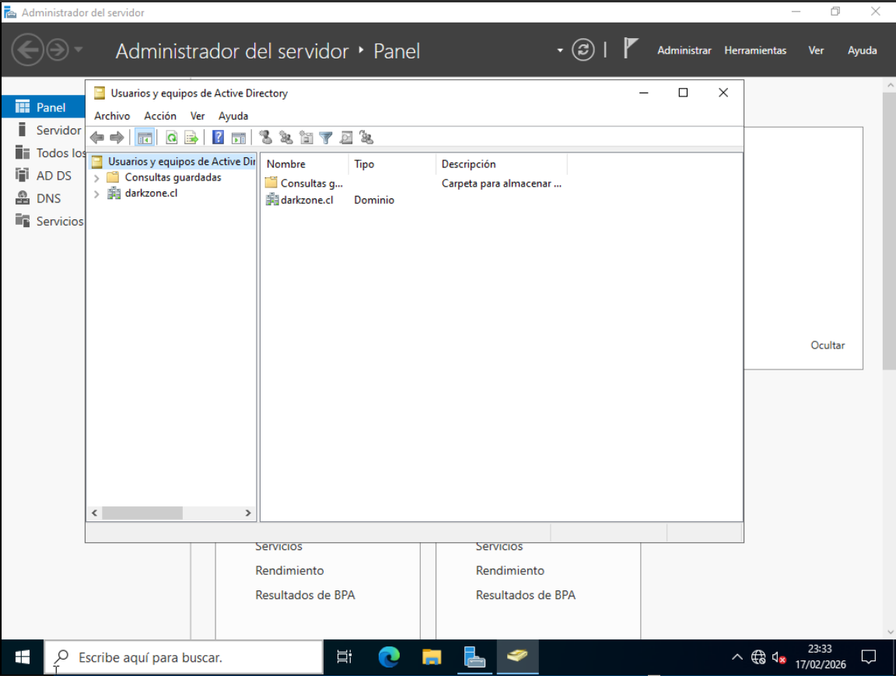
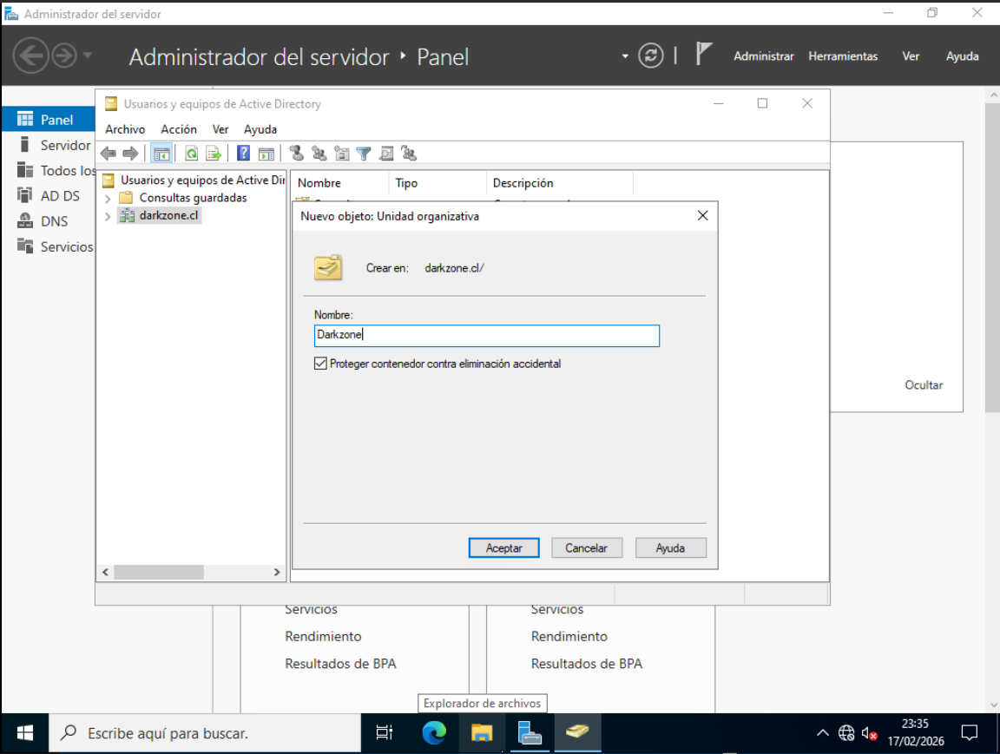
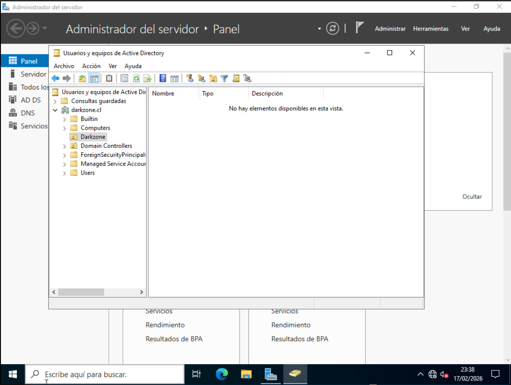
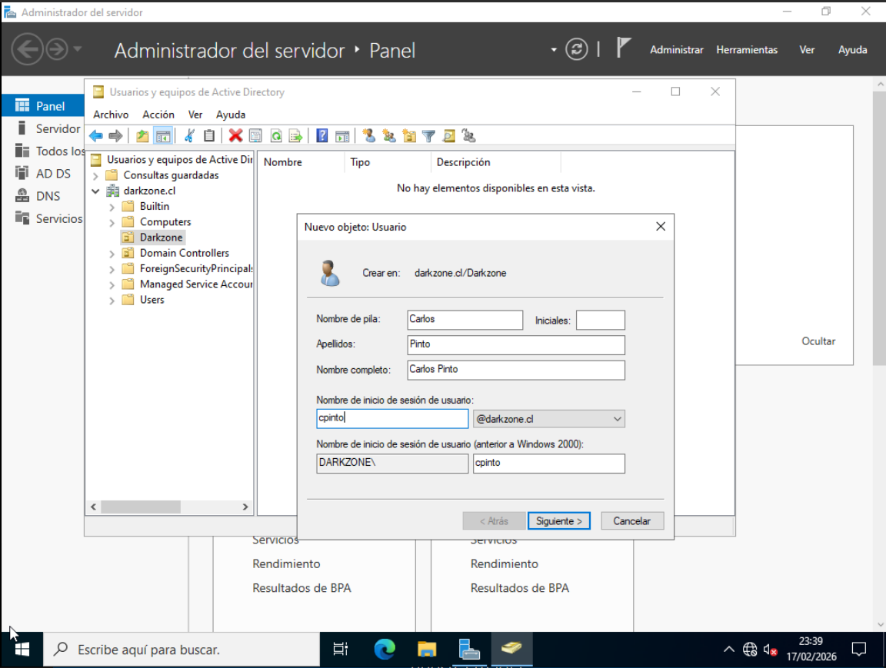
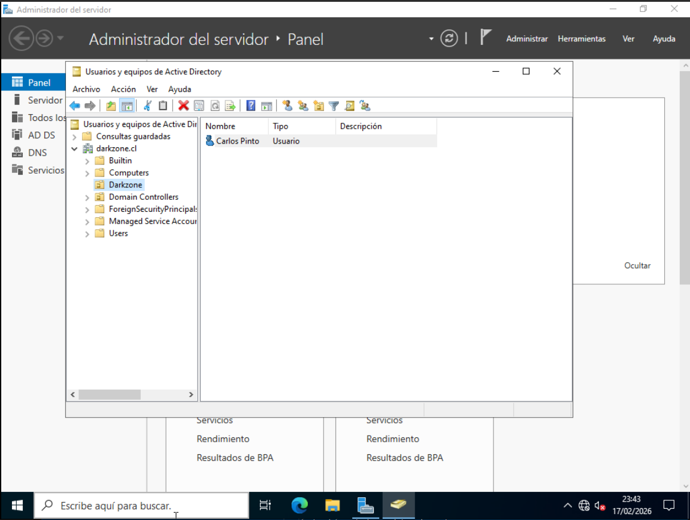

# Estructura del dominio y creación de objetos en Active Directory

## 📌 Descripción

En esta etapa se organiza el dominio `darkzone.cl` creando una estructura
básica de **Unidades Organizativas (OU)** y un usuario de prueba.

El objetivo es simular una estructura empresarial real y preparar el entorno
para la aplicación futura de políticas (GPO) y administración centralizada.

---

## 🖥️ Entorno del laboratorio

- Dominio: `darkzone.cl`
- Controlador de Dominio: DC01
- Sistema Operativo: Windows Server 2022
- Herramienta utilizada: Active Directory Users and Computers (ADUC)

---

## 🧱 Creación de la estructura de Unidades Organizativas (OU)

Para organizar correctamente los objetos del dominio, se creó una OU principal
llamada:

Darkzone

Dentro de esta OU se crearon las siguientes sub-OUs:

Darkzone
├── Usuarios
├── Equipos
├── Servidores
└── Grupos

Esta estructura permite:

- Separar usuarios de equipos
- Aplicar políticas específicas por contenedor
- Mantener una organización clara y escalable

---

## 🔧 Procedimiento para crear una OU

1. Abrir **Usuarios y equipos de Active Directory**
2. Click derecho sobre el dominio `darkzone.cl`
3. Seleccionar:

Nuevo → Unidad Organizativa

4. Asignar el nombre correspondiente
5. Marcar: Proteger contenedor contra eliminación accidental

📸 **Captura 1:**  

📸 **Captura 2:**  

📸 **Captura 3:**  

---

## 👤 Creación de usuario de prueba

Se creó un usuario de prueba dentro de la OU:

Darkzone → Usuarios

### Datos del usuario

- Nombre: Carlos
- Apellido: Pinto
- Nombre de usuario: `cpinto`
- UPN:

cpinto@darkzone.cl

Para efectos del laboratorio:

- Se desactivó la opción “El usuario debe cambiar la contraseña”
- Se activó “La contraseña nunca expira”

---

## 🔧 Procedimiento para crear un usuario

1. Navegar a:

Darkzone → Usuarios

2. Click derecho:

Nuevo → Usuario

3. Completar los datos solicitados
4. Configurar contraseña
5. Finalizar asistente

📸 **Captura 4:**  

📸 **Captura 5:**  

---

## ✅ Verificación

Se validó que:

- La estructura de OUs aparece correctamente en ADUC
- El usuario `cpinto` fue creado dentro de la OU correspondiente
- El dominio mantiene una estructura organizada y coherente

---

## 🧠 Consideraciones técnicas

- Las OUs permiten aplicar políticas (GPO) de forma granular
- Separar objetos desde el inicio evita desorden futuro
- Esta estructura es básica pero escalable

---

## 🚀 Próximo paso

- Crear grupos de seguridad
- Unir un equipo cliente (PC01) al dominio
- Aplicar primeras políticas de grupo (GPO)