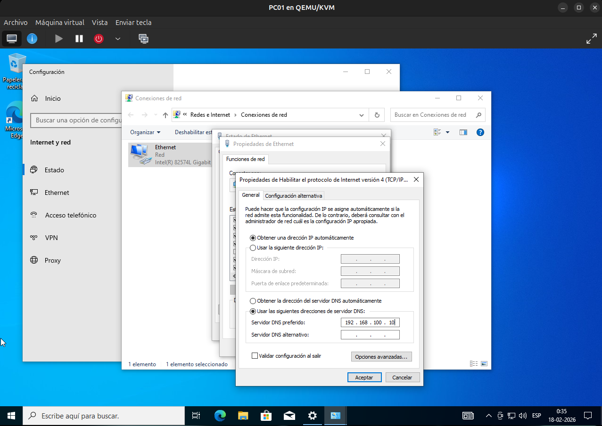
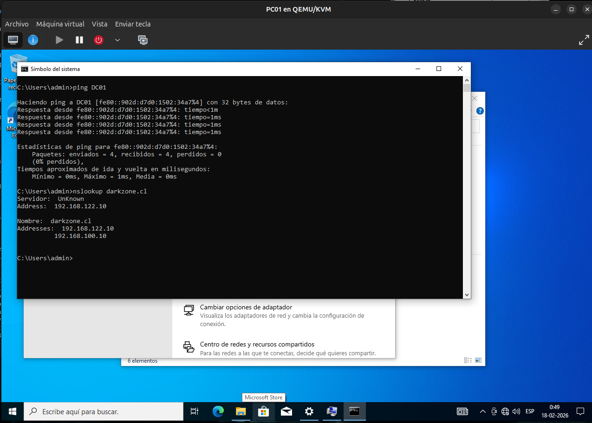
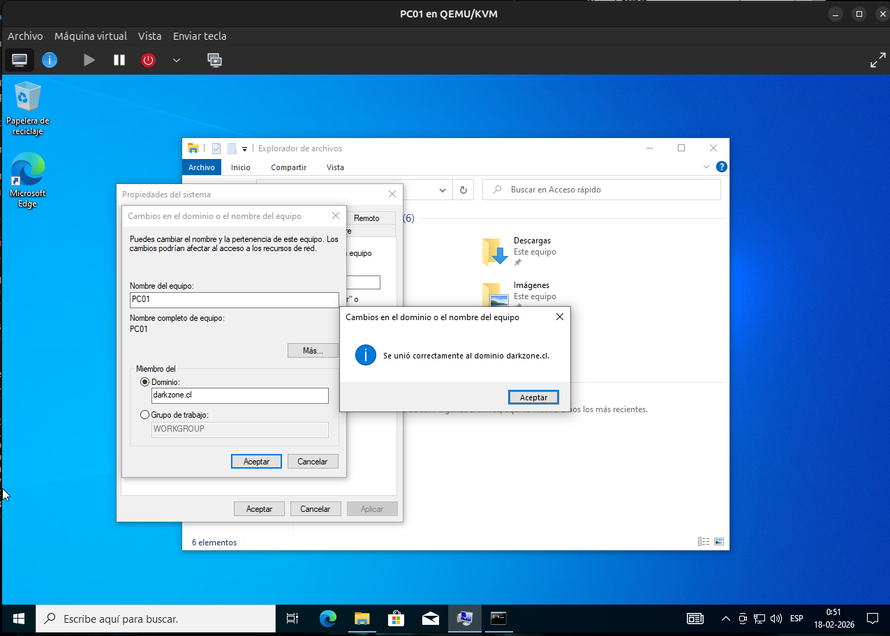
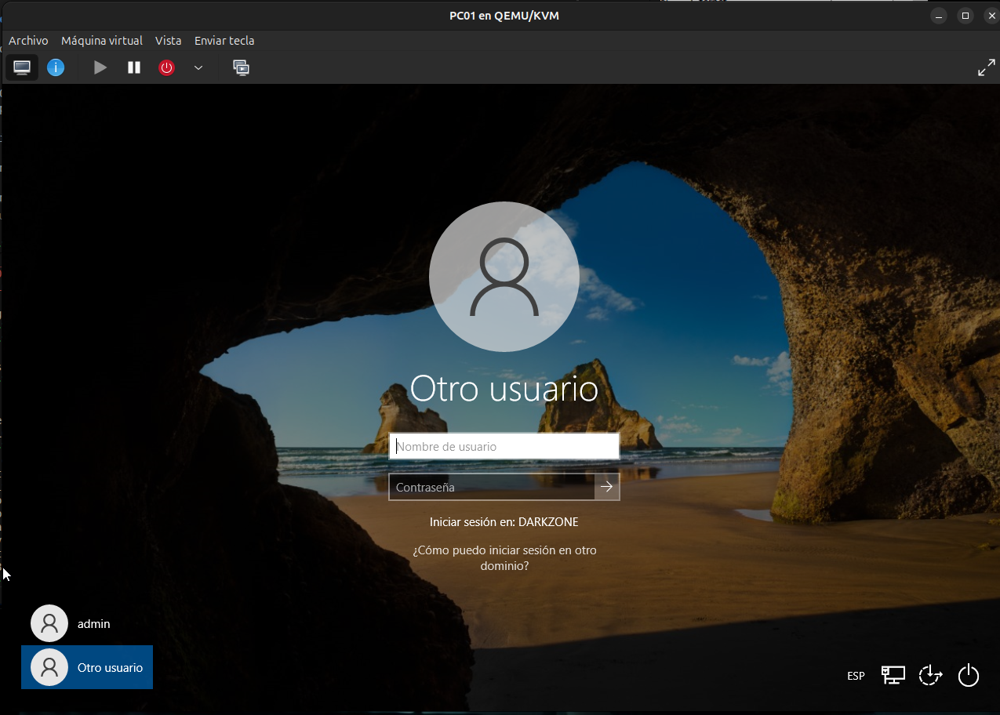
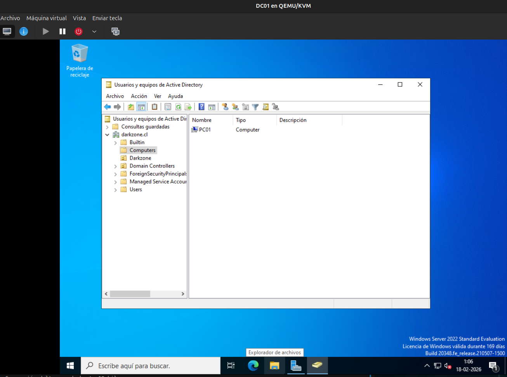

# Unión del equipo cliente (PC01) al dominio `darkzone.cl`

## 📌 Descripción

En esta etapa se une el equipo cliente **PC01** (Windows 10 Pro)
al dominio `darkzone.cl`, permitiendo la autenticación centralizada
mediante Active Directory.

Esto valida el funcionamiento correcto de:

- Active Directory Domain Services (AD DS)
- DNS del dominio
- Comunicación entre cliente y controlador de dominio

---

## 🖥️ Entorno del laboratorio

- Cliente: PC01
- Sistema Operativo: Windows 10 Pro
- Dominio: `darkzone.cl`
- Controlador de Dominio: DC01
- IP DC01: 192.168.100.10

---

## 🌐 Configuración de red del cliente

Antes de unir el equipo al dominio, se configuró el DNS del cliente
para que apunte al controlador de dominio.

Configuración:

| Parámetro | Valor |
|-----------|-------|
| IP | DHCP |
| DNS preferido | 192.168.100.10 |

⚠️ Es fundamental que el DNS apunte al DC, de lo contrario
el dominio no podrá resolverse correctamente.

📸 **Captura 1:**  


---

## 🔎 Verificación de conectividad

Se validó la comunicación con el controlador de dominio utilizando:

```cmd
ping dc01
nslookup darkzone.cl
```
Se confirmó que:

El cliente resuelve el nombre del servidor

El dominio responde correctamente por DNS

---

📸 **Captura 2:**



🔐 Unión al dominio

Procedimiento realizado:

Configuración → Sistema → Acerca de

Cambiar nombre del equipo (configuración avanzada)

Seleccionar:

Dominio


Ingresar:

darkzone.cl


Autenticarse con credenciales del dominio:

DARKZONE\Administrator


Si el proceso es exitoso, aparece el mensaje:

Bienvenido al dominio darkzone.cl

📸 **Captura 3:**



🔄 Reinicio del equipo

El sistema solicita reiniciar para aplicar los cambios.

Después del reinicio, el equipo forma parte del dominio.

📸 **Captura 4:**



👤 Inicio de sesión con usuario de dominio

En la pantalla de inicio de sesión:

Seleccionar "Otro usuario"

Ingresar:

DARKZONE\cpinto


o

cpinto@darkzone.cl


Se confirmó el acceso correcto al dominio.

📸 **Captura 5:**


✅ Verificación en el controlador de dominio

Desde DC01, en Active Directory Users and Computers,
se verificó que el equipo PC01 aparece dentro del dominio.

📸 **Captura 6:**




🧠 Consideraciones técnicas

El DNS del cliente debe apuntar al DC

La comunicación de red debe estar en la misma red virtual

Solo versiones Pro o Enterprise de Windows pueden unirse a dominio

🚀 Próximo paso

Crear y aplicar políticas de grupo (GPO)

Configurar redirección de carpetas o restricciones básicas

Administrar permisos mediante grupos de seguridad