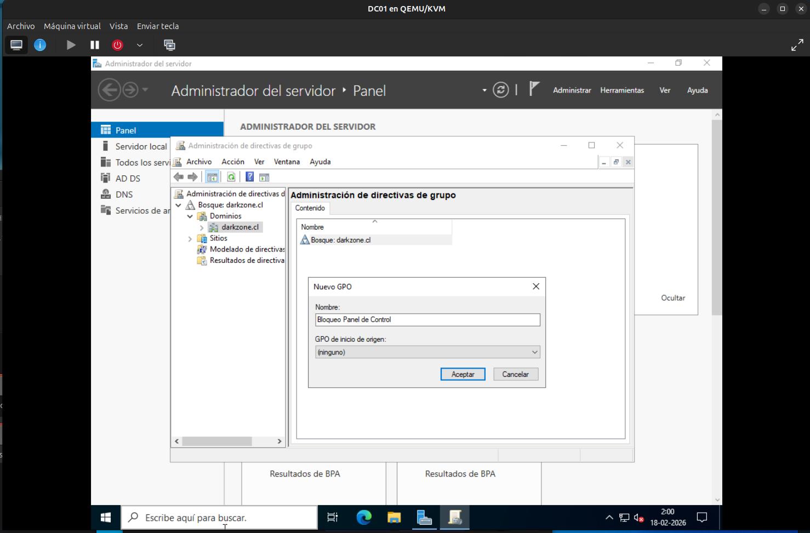
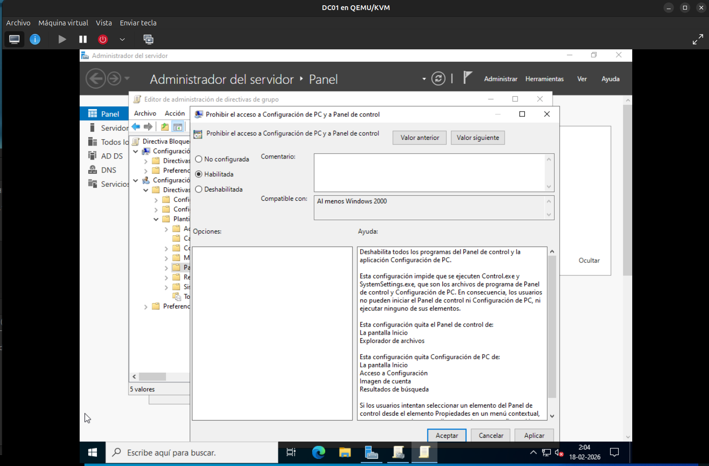
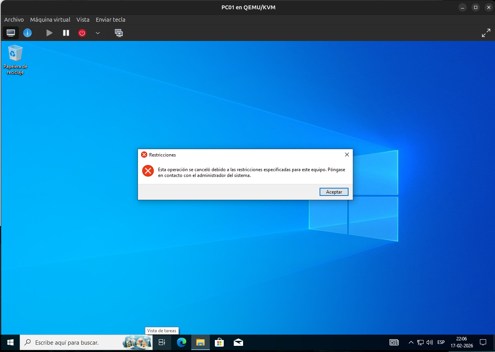
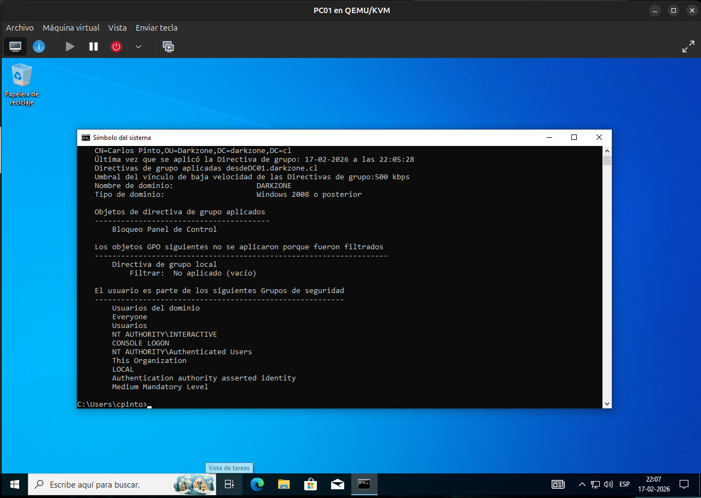

# Aplicación de GPO – Bloqueo del Panel de Control

## 📌 Descripción

En esta etapa se crea y aplica una Política de Grupo (GPO)
para bloquear el acceso al Panel de Control en los equipos
del dominio `darkzone.cl`.

El objetivo es validar:

- Creación de GPO
- Enlace a Unidad Organizativa (OU)
- Aplicación efectiva en el cliente
- Verificación mediante herramientas del sistema

---

## 🖥️ Entorno del laboratorio

- Dominio: darkzone.cl
- Controlador de Dominio: DC01
- Cliente: PC01
- Usuario afectado: cpinto
- OU aplicada: Darkzone → Usuarios

---

## 🧱 Creación de la GPO

En el servidor DC01 se accedió a:

Herramientas → Administración de directivas de grupo


Se navegó hasta:


Bosque: darkzone.cl
→ Dominios
→ darkzone.cl
→ Darkzone
→ Usuarios


Se creó una nueva GPO vinculada a la OU Usuarios con el nombre:


GPO - Bloqueo Panel de Control


📸 **Captura 1:**  


---

## ⚙ Configuración de la política

Se editó la GPO y se configuró la siguiente directiva:

Ruta:


Configuración de usuario
→ Plantillas administrativas
→ Panel de control


Política habilitada:


Prohibir el acceso al Panel de control y a Configuración


Estado:
- Habilitada

📸 **Captura 2:**  


---

## 🔄 Actualización de políticas en el cliente

En el equipo PC01, como usuario del dominio,
se ejecutó el siguiente comando:

```cmd
gpupdate /force
```

Esto forzó la actualización inmediata de las políticas de grupo.

🚫 Verificación del bloqueo

Se intentó abrir:

Panel de Control

Configuración del sistema

El sistema mostró un mensaje indicando
que el acceso fue restringido por el administrador.

📸 **Captura 3:**



🔎 Verificación técnica con gpresult

Para confirmar que la política fue aplicada,
se ejecutó en PC01:

gpresult /r


En el resultado se verificó que la GPO:

GPO - Bloqueo Panel de Control


aparece dentro de las políticas aplicadas al usuario.

📸 **Captura 4:**



✅ Resultado

Se confirmó que:

La GPO fue creada correctamente

Está vinculada a la OU adecuada

Se aplica únicamente a los usuarios dentro de dicha OU

El cliente PC01 recibe la política sin errores

🧠 Consideraciones técnicas

Las GPO pueden aplicarse a nivel de dominio o a nivel de OU

Las políticas de usuario afectan configuraciones del perfil

gpupdate /force permite aplicar cambios sin esperar el intervalo automático

gpresult /r permite verificar qué políticas están siendo aplicadas

🚀 Próximo paso

Aplicar más restricciones (CMD, dispositivos USB, etc.)

Crear GPO diferenciadas por departamento

Implementar políticas de seguridad de contraseñas