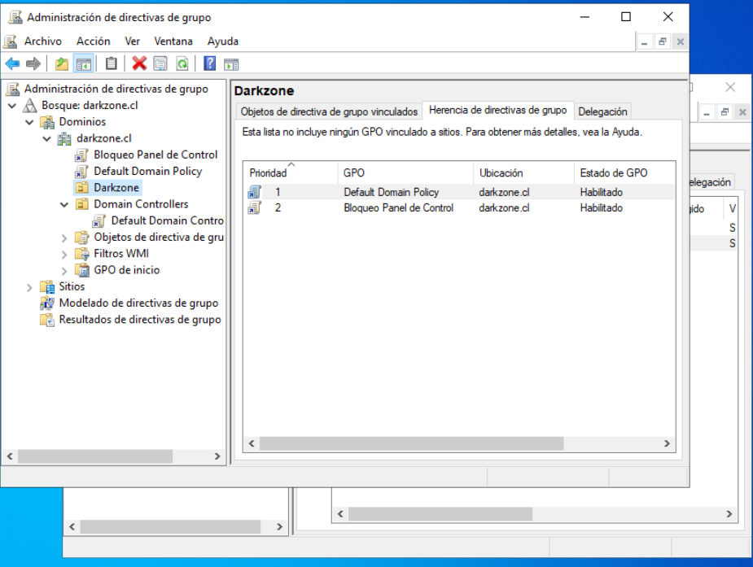
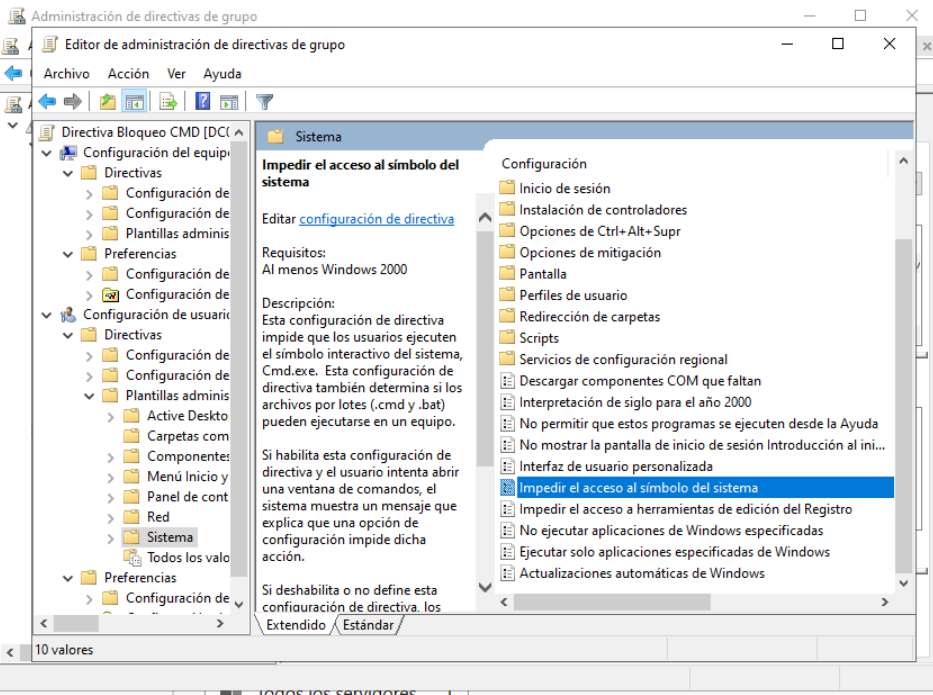

# Aplicación de GPO – Bloqueo del Símbolo del Sistema (CMD)

## 📌 Descripción

En esta etapa se implementa una segunda Política de Grupo (GPO)
para bloquear el acceso al Símbolo del sistema (CMD)
en los equipos del dominio `darkzone.cl`.

El objetivo es reforzar el control administrativo
sobre los usuarios del dominio y validar:

- Creación de múltiples GPO
- Aplicación por Unidad Organizativa (OU)
- Verificación técnica mediante gpresult
- Efecto inmediato en el cliente

---

## 🖥️ Entorno del laboratorio

- Dominio: darkzone.cl
- Controlador de Dominio: DC01
- Cliente: PC01
- Usuario afectado: cpinto
- OU aplicada: Darkzone → Usuarios

---

## 🧱 Creación de la GPO

En el servidor DC01 se accedió a:

Herramientas → Administración de directivas de grupo


Se navegó hasta:


Bosque: darkzone.cl
→ Dominios
→ darkzone.cl
→ Darkzone
→ Usuarios


Se creó una nueva GPO vinculada a la OU Usuarios con el nombre:


GPO - Bloqueo CMD


📸 **Captura 1:**  


---

## ⚙ Configuración de la política

Se editó la GPO y se configuró la siguiente directiva:

Ruta:


Configuración de usuario
→ Plantillas administrativas
→ Sistema


Política habilitada:


Impedir el acceso al símbolo del sistema


Configuración adicional:
- Deshabilitar procesamiento de scripts por lotes → Sí

Estado:
- Habilitada

📸 **Captura 2:**  


---

## 🔄 Actualización de políticas en el cliente

En PC01, como usuario del dominio,
se ejecutó:

```cmd
gpupdate /force


Esto fuerza la actualización inmediata
de las políticas de grupo.

🚫 Verificación del bloqueo

Se intentó ejecutar:

cmd


El sistema mostró un mensaje indicando
que el acceso fue restringido por el administrador.

📸 Captura 3:


🔎 Verificación técnica con gpresult

Para confirmar que la política fue aplicada,
se ejecutó en PC01:

gpresult /r


Se verificó que la GPO:

GPO - Bloqueo CMD


aparece dentro de las políticas aplicadas al usuario.

📸 Captura 4:


✅ Resultado

Se confirmó que:

La GPO fue creada correctamente

Está vinculada a la OU adecuada

Se aplica únicamente a los usuarios dentro de dicha OU

El acceso al símbolo del sistema está restringido correctamente

🧠 Consideraciones técnicas

Las GPO de usuario afectan la configuración del perfil del usuario

Si el usuario pertenece a otra OU, la política puede no aplicarse

gpresult /r es esencial para validar políticas aplicadas

El orden y herencia de GPO puede influir en el resultado final

🚀 Próximo paso

Analizar precedencia y herencia de GPO

Crear GPO diferenciadas por departamento

Aplicar políticas de seguridad más avanzadas