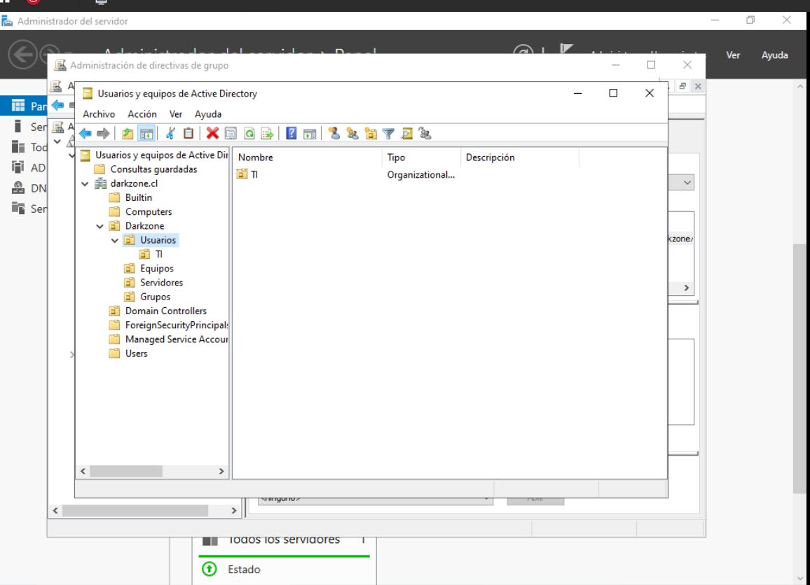
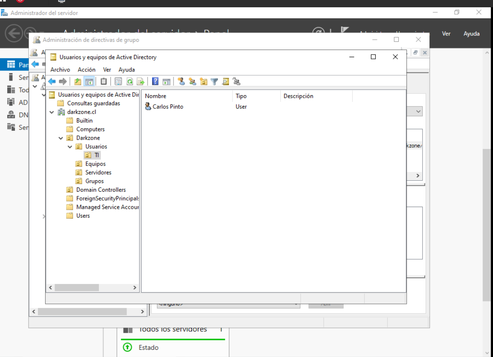
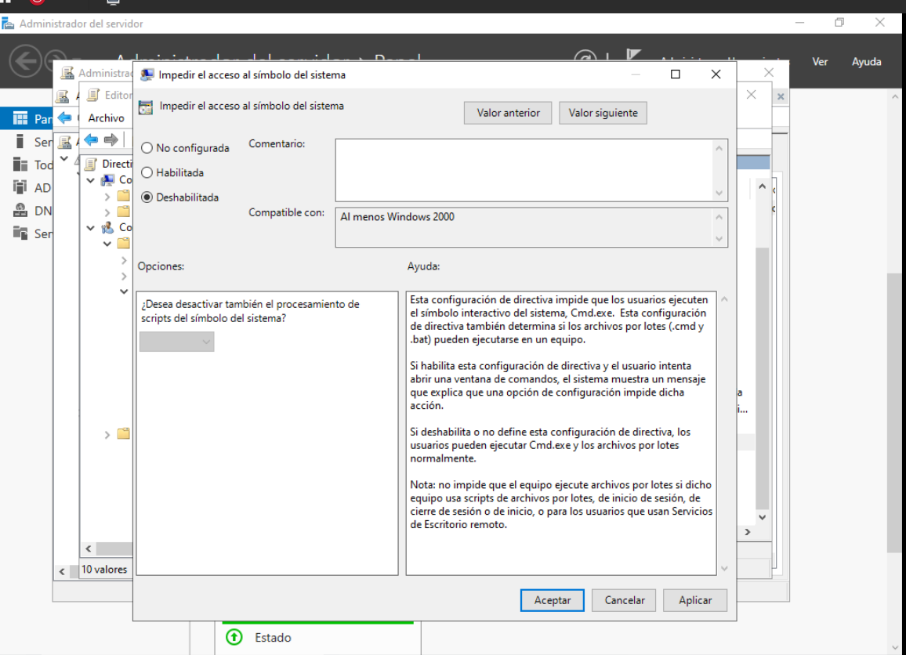
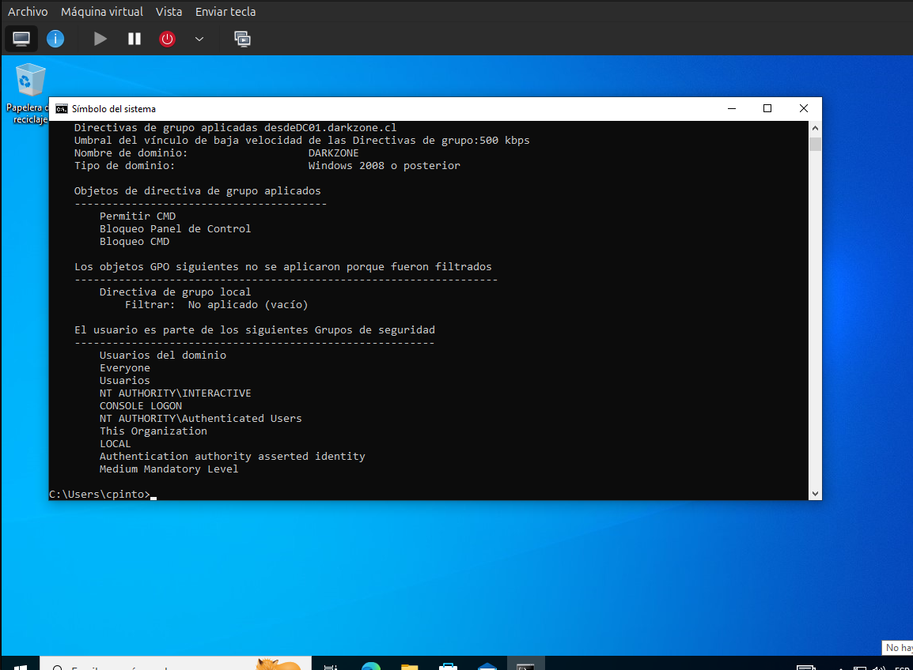

# Herencia y Precedencia de GPO en Active Directory

## 📌 Descripción

En esta etapa se analiza cómo funcionan la **herencia** y la
**precedencia** de las Políticas de Grupo (GPO) dentro del dominio
`darkzone.cl`.

Se busca comprender:

- Cómo se aplican las GPO a través de la estructura de OU
- Qué política prevalece cuando existen conflictos
- Cómo influye el orden de vínculo

---

## 🖥️ Entorno del laboratorio

- Dominio: darkzone.cl
- Controlador de Dominio: DC01
- Cliente: PC01
- Usuario de prueba: cpinto
- OU base: Darkzone → Usuarios

GPO existentes:

- GPO - Bloqueo Panel de Control
- GPO - Bloqueo CMD

---

## 🧠 Concepto de Herencia

En Active Directory, las GPO se aplican en el siguiente orden:

1. Local
2. Sitio
3. Dominio
4. Unidad Organizativa (OU)

Las GPO vinculadas a una OU superior se heredan
por las OU hijas, salvo que se bloquee la herencia.

Ejemplo de estructura:


darkzone.cl
└── Darkzone
└── Usuarios
└── TI


Si una GPO está vinculada a "Usuarios",
también afectará a "TI" por herencia.

---

## 🧠 Concepto de Precedencia

Cuando varias GPO afectan la misma configuración:

- La política vinculada más abajo en la jerarquía tiene mayor prioridad.
- El orden de vínculo dentro de una misma OU también influye.
- La última GPO aplicada es la que prevalece en caso de conflicto.

Esto permite sobrescribir configuraciones heredadas.

---

## 🧪 Escenario práctico realizado

### 1️⃣ Creación de OU hija

Se creó una nueva OU:


Darkzone → Usuarios → TI


📸 **Captura 1:**  


---

### 2️⃣ Movimiento del usuario

El usuario `cpinto` fue movido desde:


Darkzone → Usuarios


hacia:


Darkzone → Usuarios → TI


📸 **Captura 2:**  


---

### 3️⃣ Creación de GPO contradictoria

Se creó una nueva GPO vinculada únicamente a la OU "TI":


GPO - Permitir CMD TI


En esta GPO se configuró:


Configuración de usuario
→ Plantillas administrativas
→ Sistema
→ Impedir el acceso al símbolo del sistema


Estado:
- Deshabilitada

Esto contradice la GPO anterior que bloqueaba el CMD.

📸 **Captura 3:**  


---

## 🔍 Resultado esperado

Al iniciar sesión como `cpinto`:

- El Panel de Control debe seguir bloqueado (herencia).
- El CMD debe estar permitido (precedencia por OU inferior).

---

## 🔎 Verificación técnica

En PC01 se ejecutó:

```cmd
gpupdate /force
gpresult /r
```

Se verificó que:

Las GPO heredadas aparecen listadas.

La GPO de la OU inferior tiene prioridad.

📸 **Captura 4:**



✅ Resultado

Se confirmó que:

Las GPO se heredan desde la OU superior.

Una GPO en una OU hija puede sobrescribir una configuración heredada.

La estructura jerárquica determina la precedencia final.

🧠 Conclusión técnica

La herencia permite aplicar configuraciones globales,
mientras que la precedencia permite realizar excepciones
controladas en niveles inferiores.

Esto es fundamental en entornos empresariales
para aplicar políticas diferenciadas por departamento.

🚀 Próximo paso

Implementar filtrado de seguridad por grupo

Aplicar GPO solo a ciertos usuarios

Analizar bloqueo de herencia