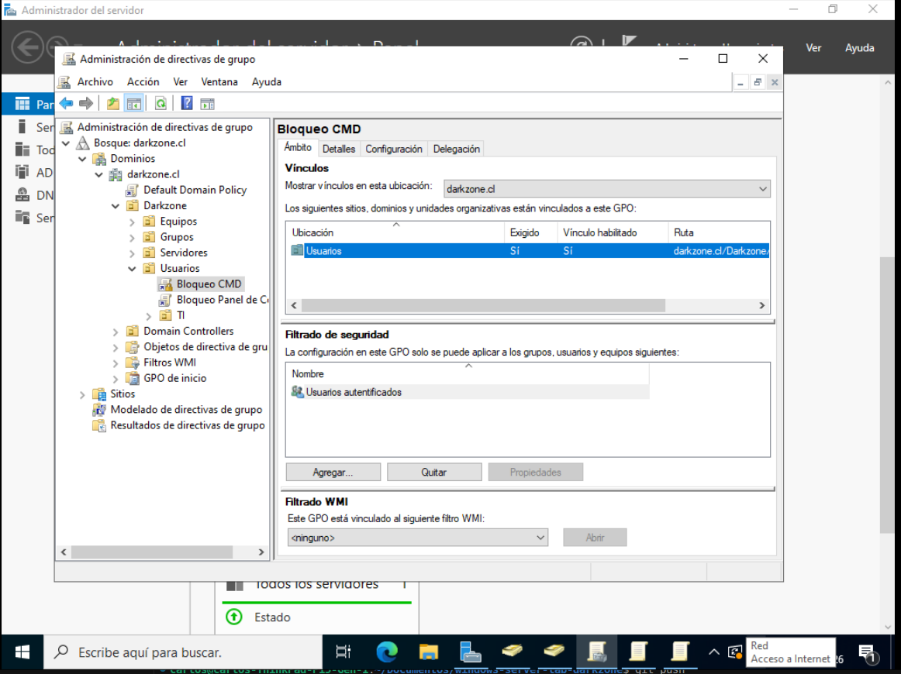
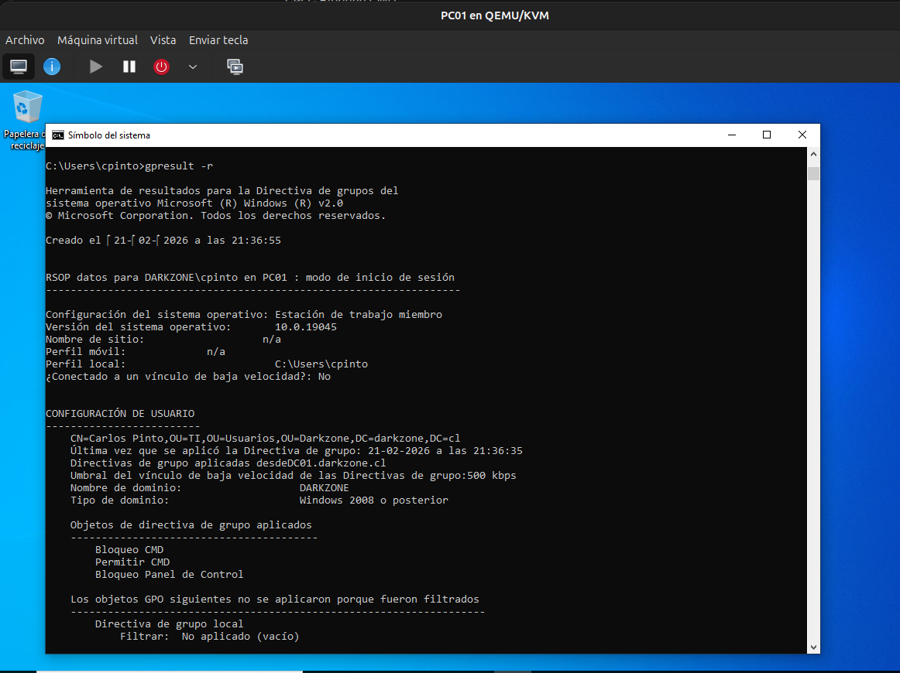

# Enforced y Bloqueo de Herencia en GPO

## 📌 Descripción

En esta etapa se analiza el comportamiento de:

- Bloqueo de herencia
- GPO marcadas como "Exigidas" (Enforced)

Se busca comprender cómo estas configuraciones
afectan la precedencia y aplicación de políticas
dentro del dominio `darkzone.cl`.

---

## 🧠 Conceptos clave

### 🔹 Herencia

Las GPO vinculadas en niveles superiores
se aplican automáticamente a las OU hijas,
salvo que se bloquee la herencia.

Ejemplo:


darkzone.cl
└── Darkzone
└── Usuarios
└── TI


Si una GPO está vinculada en "Usuarios",
también se aplicará en "TI" por herencia.

---

### 🔹 Bloquear herencia

Cuando se activa "Bloquear herencia" en una OU:

- La OU deja de recibir GPO de niveles superiores
- Solo se aplican las GPO vinculadas directamente en esa OU
- Excepto aquellas marcadas como "Exigidas"

Esto permite aislar departamentos específicos.

---

### 🔹 GPO Exigida (Enforced)

Cuando una GPO es marcada como "Exigida":

- No puede ser sobrescrita por OU inferiores
- Se aplica incluso si existe bloqueo de herencia
- Tiene prioridad superior en la jerarquía

Esto rompe la precedencia normal.

---

## 🧪 Escenario práctico realizado

### Situación inicial

- En la OU "Usuarios":
  - GPO - Bloqueo CMD

- En la OU "TI":
  - GPO - Permitir CMD

Resultado:
El usuario en TI puede usar CMD
porque la GPO inferior sobrescribe la heredada.

---

### Activando "Exigida" en la OU superior

Se marcó la GPO:


GPO - Bloqueo CMD


como **Exigida** en la OU "Usuarios".

Resultado esperado:

- La GPO de bloqueo prevalece.
- El usuario en TI ya no puede usar CMD.
- La política inferior no puede sobrescribirla.

📸 **Captura 1:**  


---

## 🔎 Verificación técnica

En el cliente se ejecutó:

```cmd
gpupdate /force
gpresult /r
```

📸 **Captura 2:**  


Se verificó que la GPO marcada como exigida
se aplica incluso cuando existe una política contradictoria
en una OU inferior.

⚠️ Consideraciones importantes

El uso excesivo de "Exigida" puede generar conflictos difíciles de diagnosticar.

No se recomienda abusar de esta configuración.

Es preferible diseñar correctamente la estructura de OU.

La segmentación por grupos suele ser una mejor práctica.

🧠 Conclusión técnica

La opción "Exigida" debe utilizarse con criterio.

En entornos empresariales grandes,
su uso incorrecto puede afectar múltiples departamentos
y romper el diseño lógico de la infraestructura.

Una buena arquitectura de OU y grupos de seguridad
reduce la necesidad de utilizar políticas forzadas.