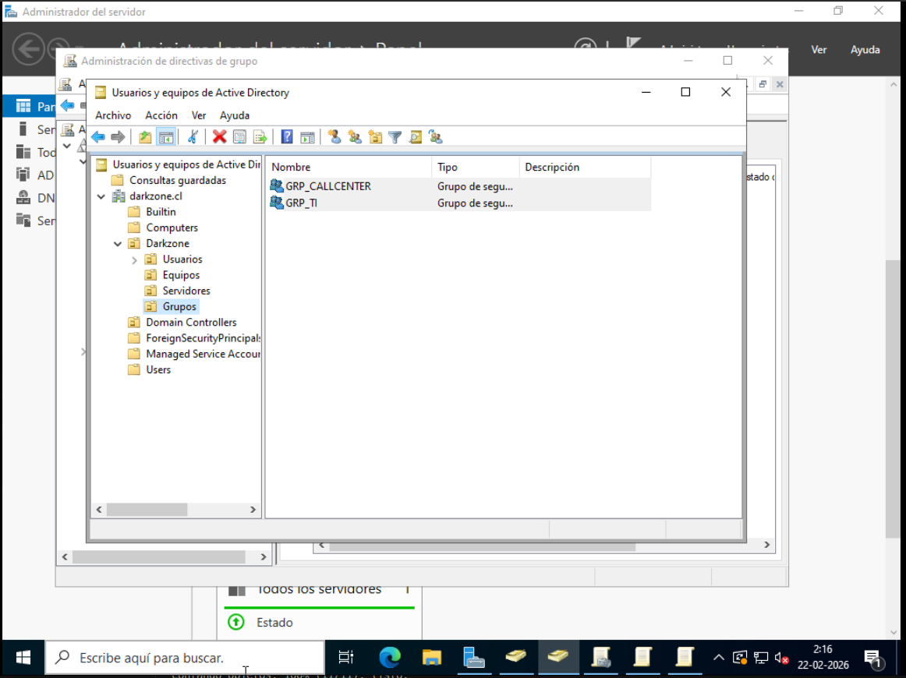
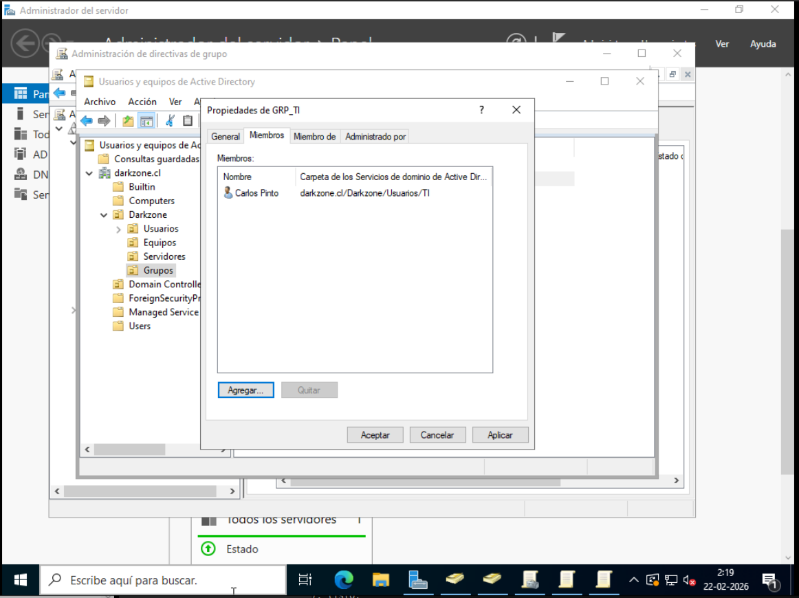
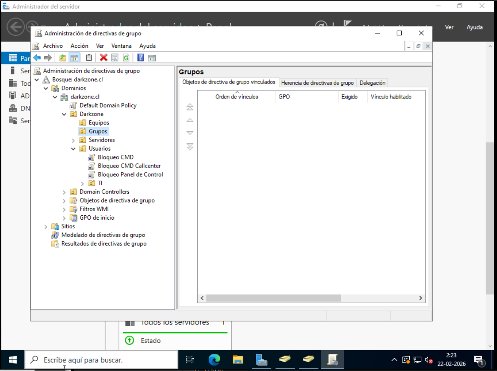
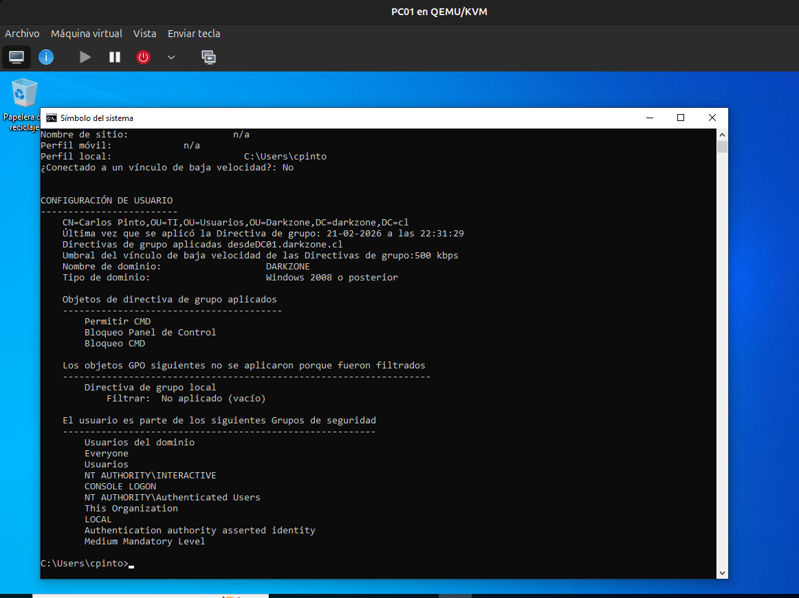

# Filtrado de Seguridad en GPO

## 📌 Descripción

En esta etapa se implementa el filtrado de seguridad
para aplicar una Política de Grupo (GPO)
únicamente a miembros de un grupo específico.

A diferencia de la aplicación por OU,
el filtrado de seguridad permite
segmentar políticas dentro de la misma estructura organizativa.

---

## 🖥️ Entorno del laboratorio

- Dominio: darkzone.cl
- Controlador de Dominio: DC01
- Cliente: PC01
- Usuario de prueba: cpinto
- OU: Darkzone → Usuarios

---

## 🧠 Concepto

Por defecto, una GPO se aplica a:


Authenticated Users


Esto significa que todos los usuarios
dentro del alcance de la OU recibirán la política.

Mediante filtrado de seguridad,
se reemplaza "Authenticated Users"
por un grupo de seguridad específico.

---

## 🧪 Escenario práctico

### 1️⃣ Creación de grupos de seguridad

Se crearon los siguientes grupos en:


Darkzone → Grupos


- GRP_TI
- GRP_Callcenter

Tipo:
- Seguridad
- Global

📸 **Captura 1:**  


---

### 2️⃣ Asignación de usuarios

- cpinto fue agregado a GRP_TI.

📸 **Captura 2:**  


---

### 3️⃣ Creación de GPO específica

Se creó una nueva GPO:


GPO - Bloqueo CMD Callcenter


Configuración:


Configuración de usuario
→ Plantillas administrativas
→ Sistema
→ Impedir el acceso al símbolo del sistema


Estado:
- Habilitada

📸 **Captura 3:**  


---

### 4️⃣ Configuración de Filtrado de Seguridad

En la sección:


Ámbito → Filtrado de seguridad


Se eliminó:


Authenticated Users


Y se agregó:


GRP_Callcenter


📸 **Captura 4:**  


---

## 🔎 Resultado esperado

- Miembros de GRP_Callcenter → CMD bloqueado.
- Miembros de GRP_TI → Sin afectación.
- Usuarios fuera del grupo → Sin afectación.

---

## 🔍 Verificación técnica

En el cliente se ejecutó:

```cmd
gpupdate /force
gpresult /r
```

Se confirmó que la GPO solo se aplica
a usuarios pertenecientes al grupo filtrado.

📸 **Captura 5:**



🧠 Conclusión

El filtrado de seguridad permite:

Aplicar políticas sin mover usuarios de OU.

Diseñar segmentaciones más flexibles.

Reducir la necesidad de múltiples OU.

Es una práctica común en entornos empresariales.