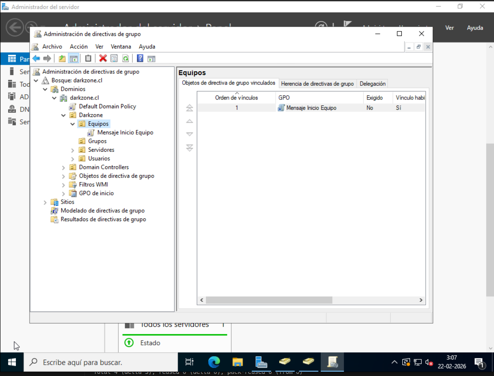
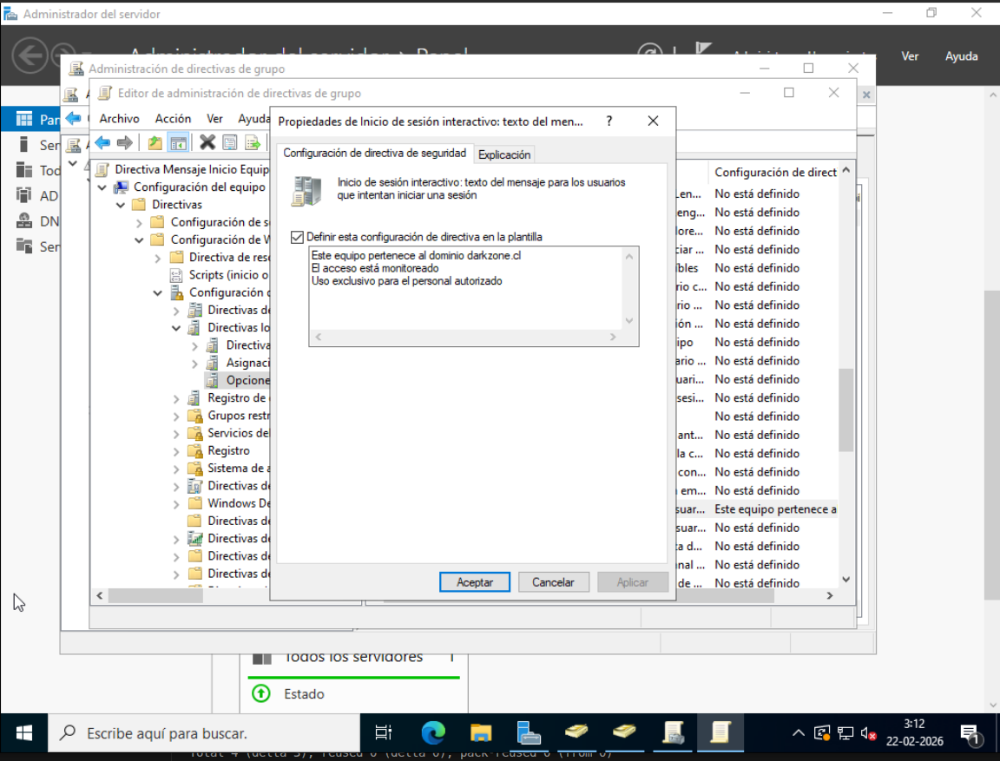
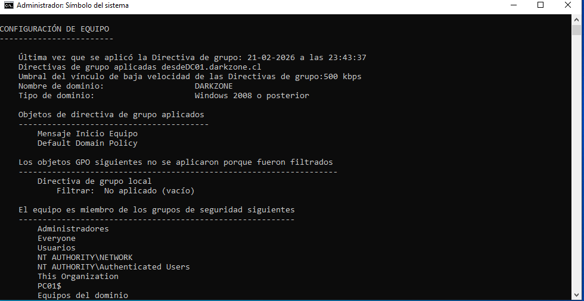

# GPO Aplicada a Nivel de Equipo (Computer Configuration)

## 📌 Descripción

En esta etapa se implementa una Política de Grupo (GPO)
aplicada a nivel de equipo utilizando:

Computer Configuration

A diferencia de las políticas de usuario,
las configuraciones de equipo:

- Se aplican cuando el equipo arranca.
- No dependen del usuario que inicia sesión.
- Afectan a todos los usuarios del equipo.

---

## 🖥️ Entorno del laboratorio

- Dominio: darkzone.cl
- Controlador de Dominio: DC01
- Equipo: PC01
- OU: Darkzone → Equipos

---

## 🧠 Diferencia conceptual

| Tipo de GPO | Momento de aplicación | Afecta a |
|-------------|----------------------|----------|
| User Configuration | Inicio de sesión | Usuario |
| Computer Configuration | Arranque del equipo | Máquina |

Las políticas de equipo se aplican incluso
antes de que el usuario inicie sesión.

---

## 🧪 Escenario práctico

Se configuró un mensaje obligatorio
que aparece antes del inicio de sesión
en el equipo PC01.

Esto permite demostrar que la política
es independiente del usuario.

---

## 🧱 Creación de la GPO

En:

Administración de directivas de grupo  
→ Darkzone  
→ Equipos  

Se creó:


GPO - Mensaje Inicio Equipo


📸 **Captura 1:**  


---

## ⚙ Configuración de la política

Ruta:


Computer Configuration
→ Windows Settings
→ Security Settings
→ Local Policies
→ Security Options


Se configuraron los siguientes parámetros:

1. Interactive logon: Message title for users attempting to log on
2. Interactive logon: Message text for users attempting to log on

Ejemplo de configuración:

Título:

Acceso Corporativo


Mensaje:

Este equipo pertenece a Darkzone.
El acceso está monitoreado.


📸 **Captura 2:**  


---

## 🔄 Aplicación en el equipo

En PC01 se ejecutó:

```cmd
gpupdate /force
```

Luego se reinició el equipo.

🔎 Verificación

Antes de mostrar la pantalla de inicio de sesión,
apareció el mensaje configurado.

Esto confirma que:

La política se aplicó a nivel de equipo.

No depende del usuario.

Se ejecuta antes del inicio de sesión.

📸 **Captura 3:**



🧠 Observación técnica

Las políticas de Computer Configuration:

Se procesan en el arranque.

Afectan a todos los usuarios del equipo.

Son ideales para configuraciones de seguridad,
firewall, auditoría y configuraciones de sistema.

✅ Resultado

Se confirmó que:

La GPO fue correctamente vinculada a la OU Equipos.

Se aplicó al equipo PC01.

El mensaje aparece independientemente del usuario que inicie sesión.

🚀 Próximo paso

Aplicar políticas de seguridad a nivel de equipo.

Configurar restricciones de dispositivos USB.

Implementar políticas de firewall mediante GPO.