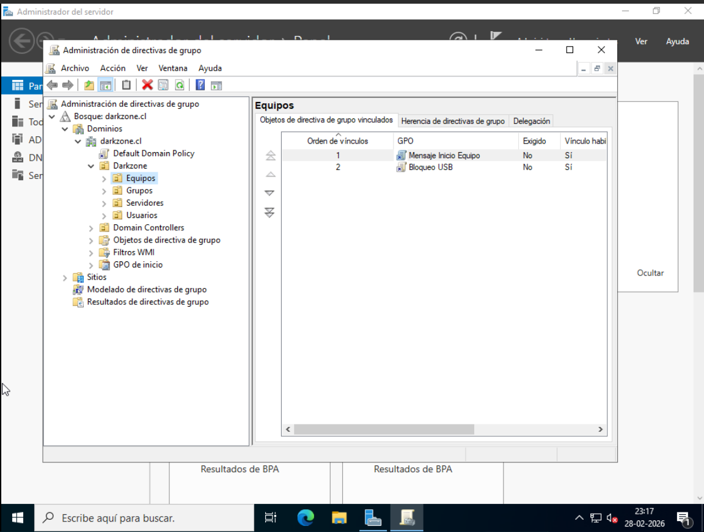
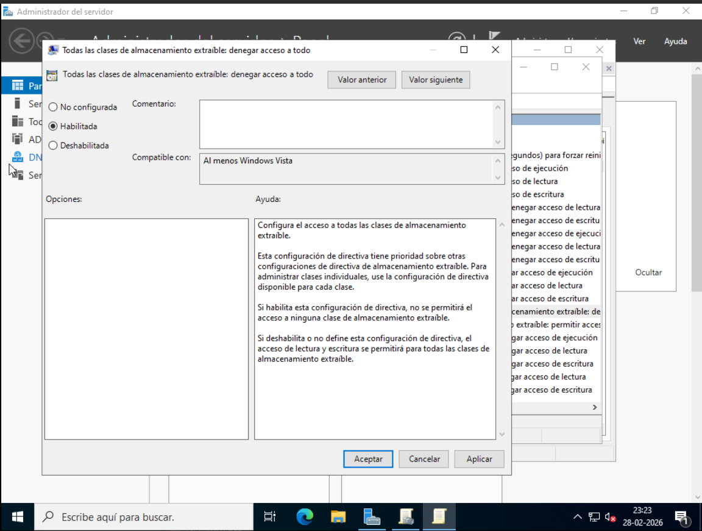
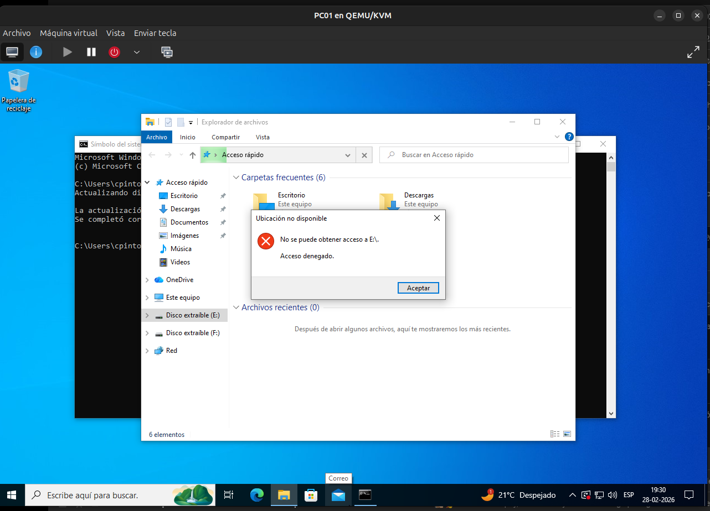

# Bloqueo de Dispositivos USB mediante GPO

## 📌 Descripción

En esta etapa se implementa una Política de Grupo (GPO)
para bloquear el uso de dispositivos de almacenamiento USB
a nivel de equipo.

Esta configuración se aplica mediante:

Computer Configuration

Lo que significa que:

- No depende del usuario.
- Se aplica al objeto computadora.
- Afecta a todos los usuarios del equipo.

---

## 🖥️ Entorno del laboratorio

- Dominio: darkzone.cl
- Controlador de Dominio: DC01
- Equipo de prueba: PC01
- OU: Darkzone → Equipos

---

## 🧠 Objetivo

Restringir el acceso a dispositivos de almacenamiento USB
en el equipo PC01 utilizando una GPO vinculada a la OU Equipos.

---

## 🧱 Creación de la GPO

En:

Administración de directivas de grupo  
→ Darkzone  
→ Equipos  

Se creó la siguiente GPO:


GPO - Bloqueo USB


📸 **Captura 1:**  


---

## ⚙ Configuración de la política

Ruta:


Computer Configuration
→ Policies
→ Administrative Templates
→ System
→ Removable Storage Access


Se configuró:


All Removable Storage classes: Deny all access


Estado:
- Habilitada

📸 **Captura 2:**  


---

## 🔄 Aplicación en el equipo

En PC01 se ejecutó:

```cmd
gpupdate /force
```
Luego se reinició el equipo.

🔎 Verificación

Al conectar un dispositivo USB:

El sistema impide el acceso.

No permite lectura ni escritura.

Se muestra mensaje de restricción.

📸 **Captura 3:**



🧠 Observaciones técnicas

Esta política:

Se aplica a nivel de equipo.

No depende del usuario.

Es ideal para entornos corporativos.

Reduce riesgos de fuga de información.

Ayuda a cumplir normativas de seguridad.

🔐 Consideraciones empresariales

En entornos reales se puede:

Aplicar solo a ciertos grupos de equipos.

Permitir excepciones mediante filtrado de seguridad.

Auditar intentos de uso de dispositivos removibles.

✅ Resultado

Se confirmó que:

La GPO fue correctamente vinculada.

Se aplicó al equipo PC01.

El acceso a dispositivos USB fue bloqueado exitosamente.